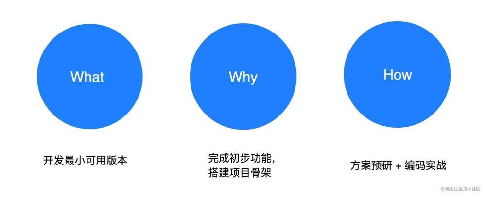

# MVP版本

> 它代表的含义是：[Minimum Viable Product – 最简化可实行产品](https://baike.baidu.com/item/MVP/3714440)

`MVP` 版本即最小可用版本，我们知道一个完整的框架项目一般都比较复杂，如果一开始就陷入到繁琐的细节当中，很容易丢失方向感，失去继续学习的动力。那么不妨一开始就从核心功能入手，了解项目最主要的结构是什么，并且用比较少的代码实现项目的骨架，而后再去补充各种细节，往往能够达到事半功倍的效果。

因此，实现 MVP 版本的目的主要有 3 个：

1. 实现核心功能
2. 搭建项目骨架
3. 输出可用版本

